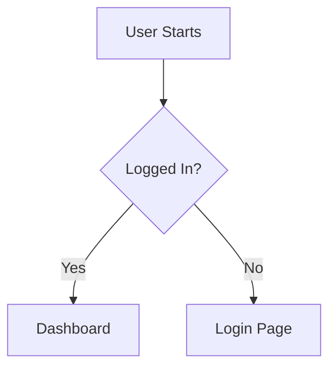

# How to Write a Product Requirements Document (PRD)

> **CRITICAL**: MUST save the final PRD to a file (e.g., `documents/prd-<slug>.md`). Do NOT only output in chat — always persist to disk.

When generating or refining a Product Requirements Document (PRD), follow these
guidelines to ensure clarity, completeness, and alignment. This rule is designed
to apply "Prompt Engineering" principles—clarity, constraints, and structure—to
documentation.

## 0. Question Format (FR-UNIVERSAL.QA-FORMAT)

When asking the user a choice (audience, constraints, timeline):

- **Numbered** — each question is a numbered list item (`1.`, `2.`, …), not a heading, a bold-only line, or a paragraph.
- **Self-contained** — the question is answerable from itself and its options alone. Name what is being decided and what the answer changes, inside the question. "Which of the above?", a bare "Your choice?", and "Which variant do you prefer?" with nothing restated are defects: they send the reader back up the transcript to reconstruct the question.
- **Each option stands on its own** — a reader often jumps straight to the options, so an option's title and the lines under it must be enough to choose without the text above the question or the earlier turns. The title is a short name after the option's letter or number, and the reader answers with that letter or number; the `**Essence:**` line under it says what would be done, to what, and what the reader gets. A short reply option with no analysis of its own (Apply / Skip / Edit) has no Essence line, and its title says it alone. Explain inside the option any id, name, number or term it takes from a report, a file or an earlier turn, and replace a pointer such as "the issues found", "as above" or "the current round" with the items it means. An explanation elsewhere in the reply does not count — not in the report above the question, not in another option — and neither does a label tucked into parentheses or an aside: explain it in the option or delete it. Before sending, go through each option alone and list every label (letters plus digits such as `E4` or `N3`), coined term and bare number in it; each must be explained in that same option or removed.
- **`agent's choice`** — on a multi-select where the user delegates with `agent's choice` (or its language equivalent), pick the subset yourself, justify the pick in one line, and proceed without re-asking for confirmation.
- When the choices are mutually exclusive alternatives with their own analysis, that analysis is nested under the option inside the question — never repeated as a separate block before it. It opens with the `**Essence:**` line, then `**Pros:**`, `**Cons:**`, `**Risks:**` and `**Best for:**`, each on its own labelled line.

## 1. Core Principles

- **Outcome-Oriented**: Focus on the _value_ delivered to the user, not just the
  technical implementation.
- **Measurable**: Requirements must be testable. Avoid vague terms like "fast"
  or "reliable" without metrics.
- **Unambiguous**: Remove ambiguity. If a requirement can be interpreted in
  multiple ways, it is a bug in the PRD.
- **Living Document**: Acknowledge that the PRD evolves. A target nobody has
  approved yet is still written as a number and marked as a proposal; it is
  never left blank or replaced by an open question.

## 2. Writing Strategy (AI Instructions)

When asked to write a PRD:

1. **Analyze the Request**: Identify the core problem, target audience, and
   business goal.
2. **Ask Clarifying Questions**: If key context is missing (e.g., "Who is this
   for?", "What are the constraints?"), ask the user before generating the full
   doc. Follow the **Question Format** section above (FR-UNIVERSAL.QA-FORMAT).
   - **Quantitative targets**: list every number the PRD will need that the
     request does not give — latency, throughput, availability, retry limits,
     supported OS or browser versions, guardrail thresholds. Ask about them in
     the same round of questions, and for each one offer a concrete recommended
     value and the reason for it — `Recommended: <value>, because <reason>` —
     so the user can accept it in one word. A value with no reason gives the
     user nothing to judge it by, and "the currently supported versions" is not
     a value. The user still decides the number; you only make the decision
     cheap.
3. **Drafting**: Use the template below. A target the user confirmed or gave is
   a requirement. A target the user left unanswered goes in as your recommended
   value marked `(proposed, awaiting approval)`, and Open Questions lists it for
   approval with that value.
4. **Review**: Check against the "Bad vs Good" examples in Section 4.
5. **Persist**: MUST write the final PRD to a file (e.g., `documents/prd-<slug>.md`
   or a path specified by the user). Do NOT only output the PRD in chat — always
   save it to disk using the file write tool (Write, write_to_file, etc.).

## 3. PRD Template

### [PRD] {Title} {Status: Draft/Review/Approved}

#### 1. Executive Summary

- **Problem Statement**: Clear, concise description of the user pain point or
  business opportunity.
- **Proposed Solution**: High-level overview of the feature/product.
- **Value Proposition**: Why is this important? What is the expected impact?

#### 2. Success Metrics (KPIs)

- **Primary Metric**: The one number that defines success (e.g., Conversion Rate
  +5%).
- **Guardrail Metrics**: What specific negative outcomes must we avoid? (e.g.,
  Latency < 200ms, Error rate < 1%).

#### 3. Scope & User Stories

**Target Audience**: [Persona Name] - [Short Description]

| ID   | User Story                                        | Acceptance Criteria              | Priority |
| ---- | ------------------------------------------------- | -------------------------------- | -------- |
| US-1 | As a [User], I want to [Action] so that [Benefit] | 1. Criterion A 2. Criterion B | P0       |

**Out of Scope**:

- List specific features or use cases that are explicitly excluded to prevent
  scope creep.

#### 4. Functional Requirements

- **Core Logic**: Detailed business rules (e.g., "If user is unverified,
  restrict access to X").
- **Edge Cases**: Empty states, error states, offline behavior.
- **Data Requirements**: Fields, validation rules, sources.

#### 5. Non-Functional Requirements

- **Performance**: Latency, throughput, load expectations.
- **Security**: Authentication, authorization, data privacy (GDPR/PII).
- **Compatibility**: Browsers, devices, OS versions.

#### 6. User Experience (UX)

- **Flow**: Describe the user journey (or insert Mermaid diagram).
- **UI Elements**: Key inputs, outputs, and feedback mechanisms.

#### 7. Dependencies & Risks

- **Dependencies**: APIs, other teams, third-party services.
- **Risks**: Technical challenges, compliance issues, adoption risks.
- **Mitigation**: How will we handle these risks?

#### 8. Open Questions

- List of unresolved questions that need input from stakeholders or technical
  research.
- Every `(proposed, awaiting approval)` target, with its proposed value.

## 4. Examples: "Bad" vs "Good" Requirements

**Ambiguity vs. Specificity**

- 🔴 **Bad**: "The system should be fast."
- 🟢 **Good**: "API response time must be under 200ms for 95% of requests at a
  load of 100 QPS."

**Implementation vs. Intent**

- 🔴 **Bad**: "Add a blue button that says Save."
- 🟢 **Good**: "The user must be able to persist their changes. The action
  should be prominent and follow the primary action style guide."

**Error Handling**

- 🔴 **Bad**: "Handle errors gracefully."
- 🟢 **Good**: "If the backend is unreachable, display a toast notification with
  the message 'Connection failed, retrying...' and automatically retry 3 times
  with exponential backoff."

## 5. Visuals

Use Mermaid diagrams where possible to illustrate flows:

